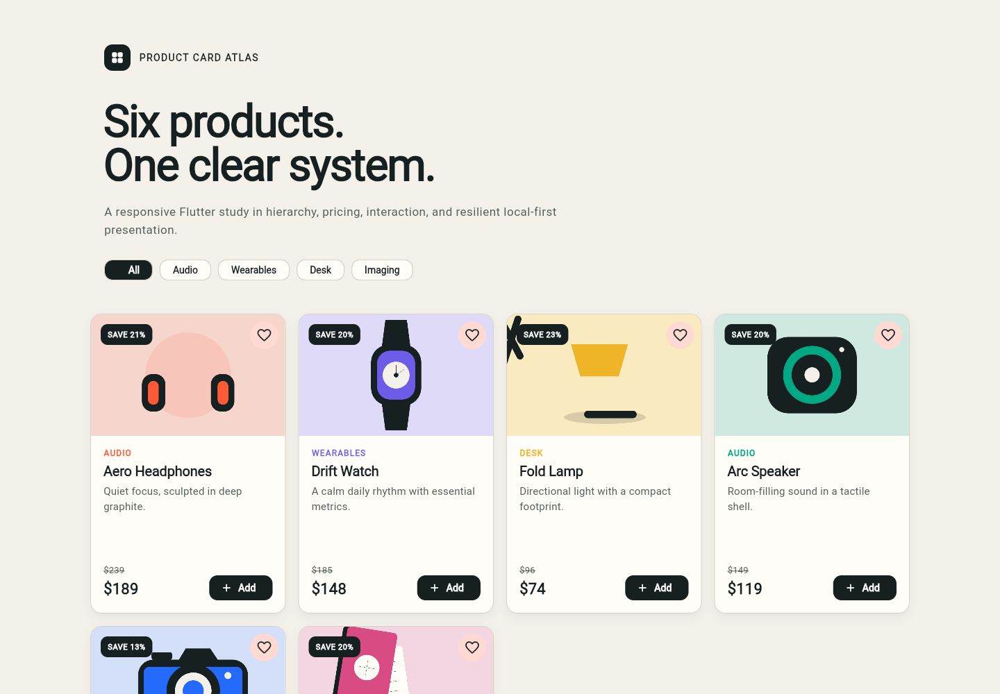
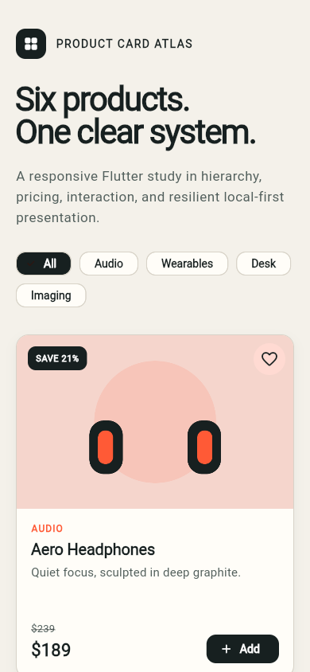

# Product Card Atlas

A responsive Flutter product-card showcase built as a small, inspectable public
code sample. It demonstrates adaptive grids, reusable UI components, local-first
data, product filtering, interaction states, and automated quality checks.

<p>
  
  
</p>

## Why this project exists

Product Card Atlas focuses on the details that make catalog interfaces useful:
clear hierarchy, readable pricing, resilient layouts, responsive behavior, and
predictable states. It intentionally uses local fixtures and original SVG
illustrations so the demo starts immediately and never depends on private APIs,
credentials, or customer data.

## Highlights

- Responsive one-to-three-column product grid
- Category filtering with accessible selection states
- Reusable product card, pricing, artwork, and action components
- Saved-product and shortlist interactions
- Local immutable product fixtures
- Original repository-owned product artwork
- Unit and widget tests
- Static analysis, formatting, build, and repository-hygiene checks in CI
- Automated GitHub Pages deployment

## Architecture

```text
lib/
├── app.dart                         # Application shell and dependencies
├── data/demo_product_repository.dart
├── models/product.dart
├── screens/showcase_page.dart       # Responsive catalog composition
├── theme/app_theme.dart
└── widgets/product_card.dart        # Reusable card and interaction states
```

The project is deliberately dependency-light. Flutter and the Dart standard
library provide everything required by the application.

## Run locally

```bash
flutter pub get
flutter run -d chrome
```

## Quality checks

```bash
dart format --output=none --set-exit-if-changed .
bash scripts/check_repository_hygiene.sh
flutter analyze
flutter test
flutter build web --release
```

## Security and privacy

- The product data layer makes no network requests.
- Demo products and illustrations are stored in the repository.
- Generated build output, IDE state, environment files, and browser-profile
  data are excluded from Git.
- The hygiene script prevents known generated paths and private endpoint
  patterns from being committed again.

See [SECURITY.md](SECURITY.md) for responsible reporting.

## License

Released under the [MIT License](LICENSE).
